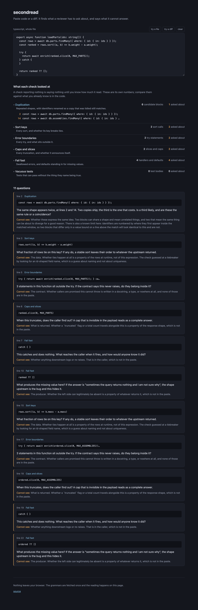

# secondread

Paste code or a diff. It finds the constructs a reviewer has to ask a question about, states the
question, and says what it cannot answer.



It does not grade your code. Every check here works from one pasted fragment, with no callers, no
data, no test run and no contract, and the questions worth asking about code mostly need one of
those. So each finding carries a **Cannot see** line naming what it would have needed. A check
that believes it can see everything is the one that reports a clean sweep of a list it barely read.

## Try it

**[rlawoals0529.github.io/secondread](https://rlawoals0529.github.io/secondread/)** - paste a file
or a `git diff`, no install

## What it looks at

| Check | Asks about | Cannot see |
| --- | --- | --- |
| Duplication | Repeated shapes, with identifiers renamed so a copy that was tidied on the way still matches | whether two blocks are the same idea or a coincidence |
| Sort keys | Every sort, and whether its key can break ties | the data, which is the only thing that says whether rows tie |
| Error boundaries | Every `try`, and what sits outside it | the contract saying whether this may throw |
| Caps and slices | Every truncation | whether the caller is told it happened |
| Fail fast | Swallowed errors, and `?? []` style defaults standing in for a value | the producer, which is where the real bug usually is |
| Vacuous tests | Assertion-free tests, and sweeps with no coverage floor | whether it passes for the right reason |

TypeScript, TSX and Python.

## The counts are the point

Every check publishes what it **considered**, not only what it flagged, and the list is expandable
so you can see its whole reach.

```
Sort keys          13 sort calls        1 asked about
```

That is a different statement from `1 sort call, 1 asked about`, and a check reporting zero says
nothing at all until you know whether it read zero constructs or four hundred.

This exists because of a specific failure. A cap detector written as the regex
`\[: *[A-Z_]*MAX` requires an uppercase letter directly after the colon, so it matched
`[:MAX_ROWS]`, missed every `[:_constants.MAX_ROWS]`, and reported one hit where the answer was
four. It was caught only by comparing its count against a number already known. Publishing both
numbers makes that comparison possible without reading the source.

## Diffs

Paste a unified diff and only the lines it **adds** are reported on. Context is still parsed,
because a hunk of nothing but added lines is rarely valid syntax and the surrounding lines are
what let the parser see the enclosing function at all. Removed lines are dropped entirely.

A diff is identified by its `@@` hunk header, never by a line starting with `+`. A TypeScript file
full of string concatenation is not a diff, and reading one as a diff analyses almost nothing.

## Why a parser and not a regex

The bug above is a regex under-reporting and saying nothing about it. A tool whose whole argument
is *check what your detector actually read* cannot itself be a pile of patterns.

That leaves one problem: **a pasted hunk is never a valid program.** It opens with the tail of one
function and closes inside the next. The TypeScript compiler API and acorn both refuse input like
that, so the choice was tree-sitter, which recovers and returns a usable tree.

That was a bet, and it was measured before anything else was built. Taking one clean function and
wrapping it the four ways a real paste arrives damaged:

| Wrapped with | Constructs found |
| --- | --- |
| nothing | the baseline |
| a leading dangling brace | identical |
| a trailing dangling brace | identical |
| both, and a tail cut mid-expression | identical |

Recovery is local. The damage does not reduce what the rest of the tree yields, and
`test/recovery.test.ts` pins it.

**The trap that came with it:** `hasError` is true on essentially every real diff paste. Using it
to reject input would refuse everything a person actually pastes, so it is reported as
`parsed with gaps` and never used as a gate.

## Privacy

Your code never leaves the page. The only fetch is the grammar itself, from this origin, once.

```
default-src 'none'; script-src 'self' 'wasm-unsafe-eval'; style-src 'self' 'unsafe-inline';
connect-src 'self'; img-src 'self' data:; font-src 'self'; base-uri 'none'; form-action 'none'
```

`connect-src 'self'` is the honest ceiling here, and it is weaker than `'none'`: this page has to
reach its own origin to load a 1.4MB grammar, so it cannot forbid the network outright. What it
forbids is every other destination, including from code nobody here wrote.

`'wasm-unsafe-eval'` is required because WebAssembly instantiation is blocked by a bare
`script-src 'self'` - measured, with the page returning nothing at all until it was added. It
permits WASM compilation and **not** JavaScript `eval`.

`npm run e2e` includes a test that fails if any request leaves the origin while code is being read.

## Run it

```bash
npm install
npm run dev
npm test      # 23 unit tests
npm run e2e   # 4, in the browser, against the built site
npm run build # dependency and grammar gates, typecheck, then build
```

Runtime dependencies are React and web-tree-sitter, and `scripts/check-deps.mjs` fails the build
if a third appears. A page people paste their source into is the wrong place for code nobody here
reviewed.

## Tests

The unit suite covers the checks, diff handling, both languages, and the recovery property above.
Ten mutations were run against it, each breaking one decision on purpose to confirm a named test
goes red. **Two survived the first pass**, and both were the suite's fault rather than the code's:

- the diff fixture had no removed lines, so deleting the removed-line filter changed nothing
- its only context sort carried an id tiebreaker, so treating context as added changed nothing
  either, because that sort would not have been flagged in either case

Both tests passed while measuring nothing, which is exactly what the vacuous-tests check in this
tool looks for. The fixture now carries a removed line and a context sort with no tiebreaker, and
all ten mutations are caught.

## A limit worth knowing

Duplication numbers identifiers by where they first appear **inside the matched window**, which is
what lets it match a copy whose variables were renamed. The cost is that two blocks differing only
in a value bound on a line above the match look identical to it. `test/duplication.test.ts` pins
both the behaviour and the limit, and the tool says so in the finding rather than in a footnote.

MIT © James Kim
